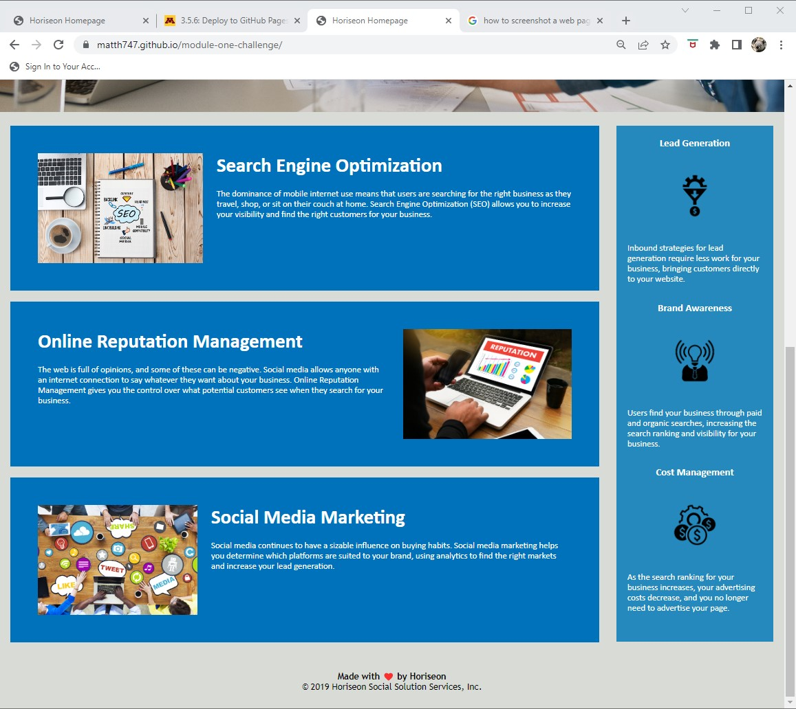

# Module One Challenge

## Description

- This project was on refactoring code to be more concise and more accessible.  Using semantic elements and alt attributes I made the html more accessible. I refactored the css to take out redundant classes copying eachother.
- I refactored this code to increase my knowledge in the first steps toward becoming a full-stack developer.
- Changing the code to make it more accessible and concise was satisfying.  Making a better version of the code that was hard to read at first was a fun challenge and I'm looking forward to the next one!

## Usage

- This site is accessible for screen readers and the code is easy for a developer to understand

## Screenshots

## License

MIT License stated in the repository

